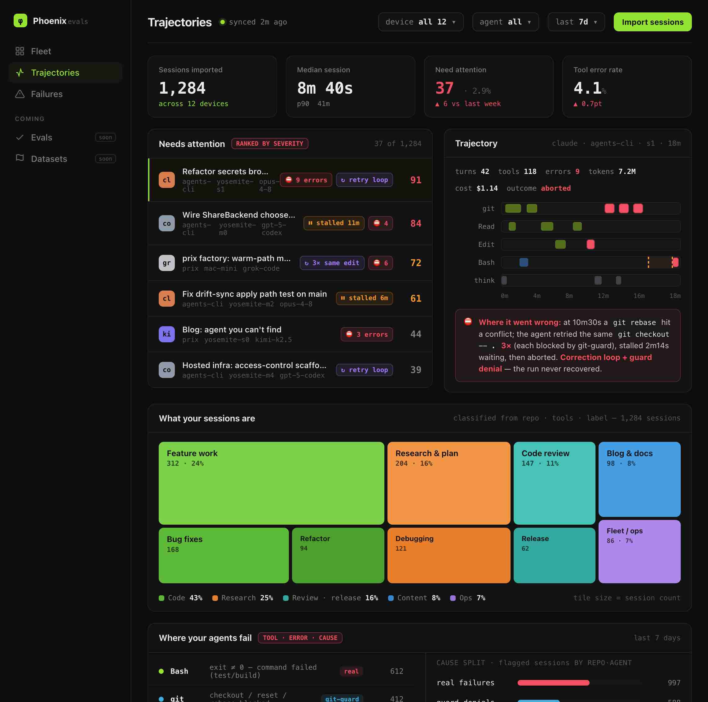
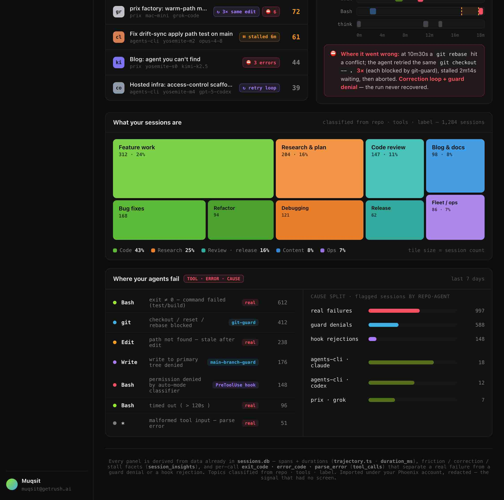

## Focus for review

The design (mockup + storage) is already approved (PR #3011). This plan is the **execution**. Weigh in on:

1. **The swarm cut** — 4 tracks across 2 repos (A: traces worker · B: `agents traces sync` · C: Prix console · D: seam verify). Is the boundary split right, or should the console (C) wait for the worker (A/B) instead of building against the fixture in parallel?
2. **The identity seam** — the one genuinely new integration. The `agents-traces` worker verifies a **Phoenix bearer** (`GET ${PHOENIX_ID_BASE}/api/v1/auth/me` → `{userId}`, `worker-template.ts:440-463`); the Prix console authenticates via **Supabase** (`getAuthenticatedUser`, `lib/auth.ts:55-108`). For the console to read a user's traces, the console's server route must present a Phoenix bearer whose `userId` equals the R2 owner segment. Confirm these are the **same** identity (Phoenix ID is the Supabase-backed getrush user) — or the console reads nothing.
3. **M3 folds into M1/M2, not a later phase** — the mockup already shows the topic **treemap** and the **cause taxonomy**, both of which need M3's classification. So topic-classify + failure-cause attribution ship *inside* the shard (Track B, CLI-side compute) and the console just renders them. M4 (score-a-run) stays out of scope. Agree?

## Purpose

The design is approved (mockup + protected trace store, PR #3011); this plan is the build. It ships the wedge — **M1 store+sync + M2 console v0** — as a 4-track `agents teams` swarm across two repos, so the user goes from "trajectories exist only in a terminal, one session at a time" to a **Trajectories** tab in the Prix Dev console showing their whole fleet's failure hotspots. M3's classification folds into the shard (the mockup already shows the treemap + taxonomy); M4 (score-a-run) stays out of scope.

## Proposed Changes

The build is **a protected sync + a console tab** — not a new analysis engine. Every number already exists in `sessions.db`; we carry it off-box, redacted, and give it a screen.

<div class="artifact-behavior">
  <div class="artifact-behavior-panel" data-state="current" data-evidence="capture">
    <strong>Today:</strong> to see a trajectory you run <code>agents sessions trace &lt;id&gt;</code> in a terminal, one session at a time, on the machine that ran it (<code>trajectory.ts</code> computes it fresh, never persists it). There is no cross-device view and no place a human looks. The Prix Dev console has one data page — <code>/console/analytics</code> — and it shows aggregate rollups (success rate, cost, ratings) from Supabase, with a quality signal of human 1–5 stars only.
  </div>
  <div class="artifact-behavior-panel" data-state="proposed" data-evidence="mockup">
    <strong>Proposed:</strong> the user signs in, runs <code>agents traces sync</code> once per device, and a new <strong>Trajectories</strong> tab appears next to Analytics in the same console. It shows their whole fleet: a stat strip, a severity-ranked <em>Needs attention</em> list, a click-through <em>trajectory waterfall</em> with a plain-language "where it went wrong", a <em>session-topic treemap</em>, and a <em>failure taxonomy</em> that separates a real command failure from a <code>git-guard</code> denial from a <code>PreToolUse</code> hook rejection. Private to them — no trace is ever publicly readable.
  </div>
</div>

The proposed surface is the approved v0 mockup (`console-v0-mockup.html`, committed 2026-08-24), rendered here:

<figure class="artifact-figure">
  
  <figcaption><b>Figure 1a.</b> Console v0 top: stat strip · severity-ranked Needs-attention · trajectory waterfall + "where it went wrong". Every number is derived from <code>sessions.db</code> the CLI already computes.</figcaption>
</figure>

<figure class="artifact-figure">
  
  <figcaption><b>Figure 1b.</b> Console v0 bottom: the session-topic treemap (Code/Research/Review/Content/Ops) and the <code>tool · error · cause</code> taxonomy — the cause badge separates a real failure from a guard denial from a hook rejection.</figcaption>
</figure>

## Current architecture — two disjoint halves, and the seam we add

The signal already exists and is thrown away; the console already exists and reads a different store. Phoenix Evals is the **connective sync** between them, not a new analysis engine.

<figure class="artifact-figure artifact-figure-diagram artifact-figure-wide">
  <svg class="artifact-diagram" viewBox="0 0 940 430" role="img" aria-label="agents-cli computes trajectory signal per device but never persists it off-box; the Prix web console reads Supabase analytics; the new agents-traces worker plus R2 is the seam that carries redacted shards from every device to the console">
    <text x="24" y="24" font-family="Inter, system-ui, sans-serif" font-weight="700" font-size="13" fill="#a3e635">agents-cli · YOUR DEVICES (exists)</text>
    <rect x="24" y="36" width="236" height="70" rx="8" fill="#0f160a" stroke="#a3e635" stroke-width="1.4"/>
    <text x="36" y="58" font-family="Inter, sans-serif" font-size="12" fill="#c8c8c8">sessions.db · per device</text>
    <text x="36" y="76" font-family="'JetBrains Mono', monospace" font-size="9.5" fill="#7c9a4e">tool_calls · session_insights</text>
    <text x="36" y="92" font-family="'JetBrains Mono', monospace" font-size="9.5" fill="#7c9a4e">sessions(topic,label,duration_ms)</text>
    <rect x="24" y="120" width="236" height="66" rx="8" fill="#0f160a" stroke="#a3e635" stroke-width="1.4"/>
    <text x="36" y="142" font-family="Inter, sans-serif" font-size="12" fill="#c8c8c8">trajectory.ts (derived, not stored)</text>
    <text x="36" y="160" font-family="'JetBrains Mono', monospace" font-size="9.5" fill="#7c9a4e">spans · gaps/stalls · errorCount</text>
    <text x="36" y="176" font-family="'JetBrains Mono', monospace" font-size="9.5" fill="#f0616d">→ no off-box sync exists today</text>
    <rect x="24" y="212" width="236" height="66" rx="8" fill="#12100a" stroke="#f4b942" stroke-width="1.8" stroke-dasharray="5 3"/>
    <text x="36" y="234" font-family="Inter, sans-serif" font-weight="700" font-size="11.5" fill="#f4b942">NEW · Track B: agents traces sync</text>
    <text x="36" y="252" font-family="'JetBrains Mono', monospace" font-size="9.5" fill="#c8c8c8">compute + REDACT + classify → shard</text>
    <text x="36" y="268" font-family="'JetBrains Mono', monospace" font-size="9.5" fill="#c8c8c8">PUT owner-namespaced</text>
    <text x="330" y="24" font-family="Inter, sans-serif" font-weight="700" font-size="13" fill="#f4b942">NEW · Track A: agents-traces WORKER + R2</text>
    <rect x="330" y="36" width="270" height="150" rx="10" fill="#1a1206" stroke="#f59e0b" stroke-width="1.6"/>
    <text x="465" y="60" text-anchor="middle" font-family="Inter, sans-serif" font-weight="700" font-size="11" fill="#f4b942">PUT + GET both require:</text>
    <rect x="346" y="72" width="238" height="26" rx="6" fill="#0f0f12" stroke="#38bdf8" stroke-width="1.1"/>
    <text x="465" y="89" text-anchor="middle" font-family="'JetBrains Mono', monospace" font-size="10" fill="#c8c8c8">① Phoenix bearer (verifyPhoenixToken)</text>
    <rect x="346" y="104" width="238" height="26" rx="6" fill="#0f0f12" stroke="#38bdf8" stroke-width="1.1"/>
    <text x="465" y="121" text-anchor="middle" font-family="'JetBrains Mono', monospace" font-size="10" fill="#c8c8c8">② userId == object-owner segment</text>
    <rect x="346" y="136" width="238" height="22" rx="6" fill="#160a0c" stroke="#f0616d" stroke-width="1.1"/>
    <text x="465" y="151" text-anchor="middle" font-family="'JetBrains Mono', monospace" font-size="9.5" fill="#f0616d">NO public GET · cache-control: private,no-store</text>
    <text x="465" y="174" text-anchor="middle" font-family="'JetBrains Mono', monospace" font-size="9" fill="#8a8a90">R2 bucket agents-traces · &lt;userId&gt;/&lt;device&gt;/…</text>
    <text x="668" y="24" font-family="Inter, sans-serif" font-weight="700" font-size="13" fill="#b18aff">Prix Dev console (exists)</text>
    <rect x="668" y="36" width="248" height="60" rx="8" fill="#100f16" stroke="#5b5566" stroke-width="1.3"/>
    <text x="680" y="58" font-family="Inter, sans-serif" font-size="12" fill="#c8c8c8">/console/analytics (today)</text>
    <text x="680" y="76" font-family="'JetBrains Mono', monospace" font-size="9.5" fill="#8a8a90">Supabase rollups · human stars</text>
    <rect x="668" y="112" width="248" height="74" rx="8" fill="#140f1a" stroke="#b18aff" stroke-width="1.8" stroke-dasharray="5 3"/>
    <text x="680" y="134" font-family="Inter, sans-serif" font-weight="700" font-size="11.5" fill="#b18aff">NEW · Track C: /console/trajectories</text>
    <text x="680" y="152" font-family="'JetBrains Mono', monospace" font-size="9.5" fill="#c8c8c8">nav item + page + api route</text>
    <text x="680" y="168" font-family="'JetBrains Mono', monospace" font-size="9.5" fill="#c8c8c8">GET owner-scoped → render shard</text>
    <line x1="260" y1="245" x2="328" y2="130" stroke="#f4b942" stroke-width="2"/>
    <text x="250" y="205" font-family="'JetBrains Mono', monospace" font-size="9" fill="#c9a24e">PUT+bearer</text>
    <line x1="600" y1="130" x2="666" y2="150" stroke="#b18aff" stroke-width="1.8" stroke-dasharray="4 3"/>
    <text x="606" y="120" font-family="'JetBrains Mono', monospace" font-size="9" fill="#9a7fd0">GET owner-scoped</text>
    <rect x="290" y="330" width="350" height="80" rx="9" fill="#0d1408" stroke="#a3e635" stroke-width="1.5"/>
    <text x="465" y="350" text-anchor="middle" font-family="Inter, sans-serif" font-weight="700" font-size="11" fill="#a3e635">THE SEAM — serialized projection (not a new schema)</text>
    <text x="465" y="367" text-anchor="middle" font-family="'JetBrains Mono', monospace" font-size="9" fill="#c8c8c8">SessionTrajectory · tool_calls · session_insights · sessions</text>
    <text x="465" y="382" text-anchor="middle" font-family="'JetBrains Mono', monospace" font-size="9" fill="#c8c8c8">→ index.json (dashboard) · sessions/&lt;id&gt;.json (detail)</text>
    <text x="465" y="398" text-anchor="middle" font-family="'JetBrains Mono', monospace" font-size="9" fill="#7c9a4e">committed fixture both B (writer) and C (reader) validate against</text>
    <line x1="200" y1="278" x2="360" y2="330" stroke="#3a3a3f" stroke-width="1"/>
    <line x1="792" y1="186" x2="600" y2="336" stroke="#3a3a3f" stroke-width="1"/>
  </svg>
  <figcaption><b>Figure 2.</b> Two halves that never talked. Track A (worker) + Track B (sync) push redacted shards off every device; Track C reads them owner-scoped into a new console tab. The <b>shard schema</b> is the load-bearing seam — pin it first, and C builds against a fixture in parallel with A+B.</figcaption>
</figure>

## The swarm — `agents teams`, 4 tracks, 2 repos, boundary contracts

Team runs on worker boxes (offloaded from zion), each edit-mode teammate in its own worktree off freshly-fetched `origin/main`. Mixed harness roster.

| Track | Owns (writes only here) | Must NOT touch | Repo · worktree | Depends on |
|---|---|---|---|---|
| **A · traces worker** | `apps/cli/src/lib/traces/worker-template.ts` (cloned), `traces/provision.ts`, `traces/config.ts`, worker owner-isolation tests | the existing `lib/share/*` (isolation = separate files), `commands/*`, `prix/web` | agents-cli · `traces-worker` | RUSH-3135 seam (already on main) |
| **B · traces sync CLI** | `apps/cli/src/commands/traces.ts`, `apps/cli/src/lib/traces/shard.ts` (+`.test.ts`), `classify.ts` (topic + cause), `command-registry.ts` traces entry | `lib/traces/worker-template.ts` (A owns), `lib/share/*`, `prix/web` | agents-cli · `traces-sync` | shard schema (§ below); worker **routes** (contract, not code) |
| **C · Prix console v0** | `prix/web/app/console/trajectories/page.tsx`, `app/console/failures/page.tsx`, `app/api/console/trajectories/route.ts`, `components/trajectories/*`, the nav entry in `ConsoleLayoutClient.tsx` | `app/console/analytics/*`, `lib/analytics.ts`, everything in agents-cli | agents (prix/web) · `console-trajectories` | shard schema + committed **fixture** (§ below) |
| **D · seam verify** | nothing (plan mode) — runs `agents traces sync` on a real box, confirms R2 objects, drives the console, asserts owner-isolation + no-public-GET + no-cache | — | agents-cli · read-only | A, B, C |

Why C can run fully parallel to A+B: it consumes the **shard JSON**, not their TypeScript. Pin the schema + commit a `testdata/trace-shard.fixture.json` first (task 0); C renders the fixture, A+B produce the real thing, D proves they match. The only true ordering is **D after A,B,C** (`--after a,b,c`) and B's live PUT-integration after A deploys — B's shard computation and tests need neither.

```bash
agents teams create phoenix-evals --enable-worktrees \
  --devices yosemite-m0,yosemite-m1,yosemite-m3 \
  --repo git@github.com:phnx-labs/agi-cli.git
agents teams add phoenix-evals claude "Track A — agents-traces worker …" --name traces-worker --worktree traces-worker --mode auto
agents teams add phoenix-evals codex  "Track B — agents traces sync …"   --name traces-sync   --worktree traces-sync   --mode auto
# Track C is the prix/web repo — separate --repo teammate:
agents teams add phoenix-evals grok   "Track C — /console/trajectories …" --name console --worktree console --mode auto  # repo: agents (prix/web)
agents teams add phoenix-evals claude "Track D — verify the composed seam end-to-end" --name verify --mode plan --after traces-worker,traces-sync,console
agents teams start phoenix-evals --watch
```

<div class="artifact-callout">
The shard is <b>not a new schema</b> — it is the <b>serialized (wire) projection of the normalized model <code>agents sessions</code> already produces</b>: <code>SessionEvent</code> (<code>types.ts:46</code>, the cross-harness standardized event) → its persisted projections (<code>tool_calls</code>, <code>sessions</code>, <code>session_insights</code>) and the derived <code>SessionTrajectory</code> (<code>trajectory.ts:82</code>). The swarm hinges on pinning that projection + a fixture <b>before</b> spawning — then the console (Track C, prix/web) builds against the fixture fully parallel to the worker+sync (Tracks A+B, agents-cli), and Track D proves the real shard matches. The only genuinely-new fields are the two M3 classifications (<code>topic</code> group, <code>cause</code>) — derived at sync time, not a redefinition of the event model.
</div>

## The seam contract — a projection of the existing normalized model (pin this first)

**We are not inventing a schema.** `agents-cli` already transforms every harness's native transcript (Claude JSONL · Codex events · Gemini · Grok · Kimi · …) into one normalized `SessionEvent` stream — that IS the standardized format (`types.ts:1-8`: *"Everything in the session pipeline — discovery, parsing, rendering — speaks these types"*), and its shape is a stability contract (spec SES-IF-4). The shard just **serializes** that already-normalized model — the derived `SessionTrajectory`/`TrajectoryStep` (`trajectory.ts:29-109`), the `tool_calls` error fields (`db.ts:190-209`), the `session_insights` facets (`db.ts:313-330`), and `sessions` columns (`db.ts:76-135`) — into JSON for transport. **Track B exports and reuses those existing TS types; it does not hand-define parallel field names** (that would be the drift this whole question guards against — one model, defined at the source, per the repo's no-duplicate-concepts rule).

Two objects per device under `<userId>/<device>/`. **Derived signal only — no raw prompt/output text.** Every field below is the serialized form of a field that already exists in `sessions.db`; sources quoted so the writer can't drift.

```jsonc
// index.json  — the dashboard shard (one per device, merged client-side across devices)
{
  "schema": 1,
  "device": "yosemite-m1",
  "syncedAt": 1756100000000,
  "owner": "<userId>",                        // == R2 first path segment (worker enforces)
  "stats": {                                   // sessions.* aggregates (db.ts:76-135)
    "sessionsImported": 1284, "medianMs": 520000, "p90Ms": 2460000,
    "needAttention": 37, "toolErrorRate": 0.041
  },
  "needsAttention": [                          // ranked; from session_insights + trajectory.errorCount
    { "id": "…", "title": "Refactor secrets broker keychain…", "repo": "agents-cli",
      "device": "yosemite-s1", "agent": "claude", "model": "opus-4-8",
      "severity": 91, "flags": ["9 errors","retry loop"] }      // flags ← frictionSignals/correctionSignals (insights.ts:141-143)
  ],
  "topics": [                                  // treemap; classify.ts heuristic (repo·tools·label)
    { "key": "feature", "label": "Feature work", "count": 312, "group": "code" }
  ],
  "failures": {                                // taxonomy; tool_calls error fields (db.ts:190-209)
    "byToolError": [
      { "tool": "Bash", "desc": "exit≠0 — command failed", "cause": "real", "count": 612 },
      { "tool": "git",  "desc": "checkout/reset/rebase blocked", "cause": "git-guard", "count": 412 },
      { "tool": "Bash", "desc": "permission denied by auto-mode classifier", "cause": "PreToolUse hook", "count": 148 }
    ],
    "byCause": { "real": 997, "guard": 588, "hook": 148 }
  }
}
```

```jsonc
// sessions/<id>.json — per-session detail (lazy: only for a session the user opens)
{
  "schema": 1, "id": "…", "device": "…",
  "meta": { "repo": "agents-cli", "agent": "claude", "model": "opus-4-8",
            "spanMs": 1080000, "turns": 42, "tools": 118, "errorCount": 9,
            "tokens": 7200000, "costUsd": 1.14, "outcome": "aborted" },
  "steps": [                                   // serialized TrajectoryStep verbatim (trajectory.ts:29-69) — NOT redefined
    { "ordinal": 1, "lane": "git", "tool": "Bash", "startMs": 0, "durationMs": 4200,
      "outcome": "error", "label": "git rebase", "exitCode": 1 }
  ],
  "gaps": [ { "startMs": 632000, "durationMs": 134000, "afterOrdinal": 61 } ],  // stalls (trajectory.ts:72-79)
  "whereItWentWrong": "at 10m30s a git rebase hit a conflict; the agent retried git checkout -- . 3× (git-guard), stalled 2m14s, then aborted."
}
```

**Cause attribution rule** (Track B, `classify.ts`), from `tool_calls` (`db.ts:190-209`): `error`/`error_code`/`parse_error` text matched against the known guard/hook signatures → `guard` (`git-guard` / `main-branch-guard`), `hook` (`PreToolUse` classifier denial), else `real` (a genuine `exit_code != 0` / timeout / parse error). This is the one line that turns a raw failure count into the mockup's cause badge.

## Data plane — what actually moves, how often, and why R2 (not the alternatives)

"Serialized results" was too vague — here is the precise data contract, the sync protocol, and why this storage tier over the others.

### Principle — three data tiers, exactly one crosses the boundary

The device holds three tiers. Only the derived projection ever leaves the box.

| Tier (on device) | Contains | Crosses to R2? | Why |
|---|---|---|---|
| **Raw transcript** | harness JSONL — full prompts + outputs | **Never** | the sensitive asset; the "your data stays yours" story is *transcripts never leave the box* |
| **Normalized index** (`sessions.db`) | `tool_calls.input/output/error`, full event rows | **Never** (as-is) | device-local schema (`SCHEMA_VERSION 40`), redacted-but-substantial evidence text, MB–GB, internal |
| **Derived projection** (the shard) | spans · outcomes · counts · classifications — **no raw text** | **Yes** | small, lossy-by-design, read-optimized, safe to store |

So R2 carries a **derived, redacted projection**, not a database and not a transcript. **This is not a backup.** Backup is a *separate* product that already exists — `agents sessions export --encrypt` (spec SES-24/25): full transcripts, client-encrypted, for *restore*. Phoenix traces are a lossy analytics view for *reading and ranking*. Different shape, different store, different purpose — don't conflate them.

### The object model — a small index + immutable detail + a device manifest

Three object kinds under `<userId>/`, mirroring the static-site (index + content-addressed detail) pattern:

| Object | Holds | Write cadence |
|---|---|---|
| `devices.json` | manifest: the user's devices + per-device `syncedAt`, counts | each sync (this device's entry only) |
| `<device>/index.json` | dashboard rollup: stat aggregates · top-N needs-attention (refs+severity) · topic counts · cause counts | each sync (recomputed) |
| `<device>/sessions/<id>.json` | one session's trajectory detail (spans · gaps · where-it-went-wrong) | **write-once** — a finished session's trajectory is immutable |

**Immutability is the load-bearing property.** A completed session's derived trajectory never changes, so `sessions/<id>.json` is write-once/read-many and fully cacheable. Steady-state sync therefore writes only *newly-ended* sessions' detail plus a recomputed index — history is never re-uploaded.

### The sync protocol — incremental, idempotent, per-device-owned

<figure class="artifact-figure artifact-figure-diagram artifact-figure-wide">
  <svg class="artifact-diagram" viewBox="0 0 920 210" role="img" aria-label="Each device reads its sync cursor, selects only changed sessions, builds redacted derived detail, PUTs changed detail objects and a recomputed index through the bearer-and-owner-checked worker into its own R2 namespace; the console reads the device manifest then each index, merges and ranks client-side, and fetches detail on drill-down">
    <text x="16" y="24" font-family="Inter, sans-serif" font-weight="700" font-size="11.5" fill="#a3e635">DEVICE (owns its own namespace — no cross-device write contention)</text>
    <rect x="16" y="36" width="250" height="150" rx="8" fill="#0f160a" stroke="#a3e635" stroke-width="1.4"/>
    <text x="30" y="58" font-family="'JetBrains Mono', monospace" font-size="9.5" fill="#c8c8c8">1 read sync cursor (high-water mark)</text>
    <text x="30" y="76" font-family="'JetBrains Mono', monospace" font-size="9.5" fill="#c8c8c8">2 select sessions changed since it</text>
    <text x="30" y="94" font-family="'JetBrains Mono', monospace" font-size="9.5" fill="#c8c8c8">3 build derived + REDACT + classify</text>
    <text x="30" y="112" font-family="'JetBrains Mono', monospace" font-size="9.5" fill="#c8c8c8">4 PUT detail IF content-hash changed</text>
    <text x="30" y="130" font-family="'JetBrains Mono', monospace" font-size="9.5" fill="#c8c8c8">5 recompute + PUT index.json</text>
    <text x="30" y="148" font-family="'JetBrains Mono', monospace" font-size="9.5" fill="#c8c8c8">6 update devices.json entry</text>
    <text x="30" y="166" font-family="'JetBrains Mono', monospace" font-size="9.5" fill="#7c9a4e">7 advance cursor (no-op sync = 0 bytes)</text>
    <rect x="300" y="60" width="150" height="90" rx="8" fill="#1a1206" stroke="#f59e0b" stroke-width="1.5"/>
    <text x="375" y="82" text-anchor="middle" font-family="Inter, sans-serif" font-weight="700" font-size="10.5" fill="#f4b942">WORKER (guard)</text>
    <text x="375" y="102" text-anchor="middle" font-family="'JetBrains Mono', monospace" font-size="8.5" fill="#c8c8c8">bearer + owner check</text>
    <text x="375" y="118" text-anchor="middle" font-family="'JetBrains Mono', monospace" font-size="8.5" fill="#c8c8c8">every PUT + GET</text>
    <text x="375" y="136" text-anchor="middle" font-family="'JetBrains Mono', monospace" font-size="8.5" fill="#f0616d">no public GET · no-store</text>
    <rect x="484" y="48" width="170" height="120" rx="8" fill="#0f0f12" stroke="#56b6e6" stroke-width="1.5"/>
    <text x="569" y="68" text-anchor="middle" font-family="Inter, sans-serif" font-weight="700" font-size="10.5" fill="#56b6e6">R2 &lt;userId&gt;/</text>
    <text x="569" y="88" text-anchor="middle" font-family="'JetBrains Mono', monospace" font-size="8.5" fill="#8a8a90">devices.json</text>
    <text x="569" y="106" text-anchor="middle" font-family="'JetBrains Mono', monospace" font-size="8.5" fill="#8a8a90">&lt;device&gt;/index.json</text>
    <text x="569" y="124" text-anchor="middle" font-family="'JetBrains Mono', monospace" font-size="8.5" fill="#8a8a90">&lt;device&gt;/sessions/&lt;id&gt;.json</text>
    <text x="569" y="146" text-anchor="middle" font-family="'JetBrains Mono', monospace" font-size="8" fill="#7c9a4e">immutable detail · cacheable</text>
    <rect x="688" y="60" width="216" height="90" rx="8" fill="#140f1a" stroke="#b18aff" stroke-width="1.5"/>
    <text x="796" y="80" text-anchor="middle" font-family="Inter, sans-serif" font-weight="700" font-size="10.5" fill="#b18aff">CONSOLE (read-only)</text>
    <text x="796" y="100" text-anchor="middle" font-family="'JetBrains Mono', monospace" font-size="8.5" fill="#c8c8c8">GET devices.json → each index</text>
    <text x="796" y="116" text-anchor="middle" font-family="'JetBrains Mono', monospace" font-size="8.5" fill="#c8c8c8">MERGE + RANK client-side</text>
    <text x="796" y="134" text-anchor="middle" font-family="'JetBrains Mono', monospace" font-size="8.5" fill="#c8c8c8">GET detail on drill-down</text>
    <line x1="266" y1="105" x2="298" y2="105" stroke="#f4b942" stroke-width="1.8"/>
    <text x="268" y="98" font-family="'JetBrains Mono', monospace" font-size="8" fill="#c9a24e">PUT+bearer</text>
    <line x1="450" y1="105" x2="482" y2="105" stroke="#f59e0b" stroke-width="1.8"/>
    <line x1="688" y1="105" x2="656" y2="105" stroke="#b18aff" stroke-width="1.6" stroke-dasharray="4 3"/>
    <text x="658" y="98" font-family="'JetBrains Mono', monospace" font-size="8" fill="#9a7fd0">GET owner-scoped</text>
    <text x="16" y="204" font-family="Inter, sans-serif" font-size="9.5" fill="#8a8a90">Consistency = eventual, per-device. Rank by severity (deterministic from the data), never wall-clock — so the client-side merge is stable across device clock skew.</text>
  </svg>
  <figcaption><b>Figure 4.</b> The sync loop. Each device pushes only what changed into its own namespace (no cross-device contention, no distributed transaction); the console reads the manifest, merges the per-device indexes, and ranks. A no-op sync moves zero bytes.</figcaption>
</figure>

**Refresh cadence.** v0 = manual `agents traces sync`, plus an **opt-in routine** (the existing scheduler) at ~30-min cadence — *not* per-session (too chatty) and *not* on the hot index scan (too expensive — the same reason `session_insights` is lazy). Later: a daemon tick piggybacking `runSessionIndexWarmTick`, or a Stop-hook that queues an ended session for the next push. Because detail is immutable, more frequent syncs just mean fresher *aggregates*, never re-uploaded history.

### Why R2 for v0 — and the alternatives, with the trade

| Option | What crosses | Verdict |
|---|---|---|
| **A · Full `sessions.db` dump** | the whole SQLite file | ✗ ships redacted-but-real evidence text; couples the console to the internal `SCHEMA_VERSION`; MB–GB re-upload; server must run SQLite to merge |
| **B · Raw transcripts, compute server-side** | harness JSONL | ✗ ships the sensitive asset; breaks the privacy story; re-implements compute the CLI already does |
| **C · Derived projection → R2 blobs** *(chosen for v0)* | small redacted JSON | ✓ derived-only; reuses the `agents-share` worker+R2 machinery; zero-egress; no schema migrations; client-side merge of ≤~20 device indexes is trivial |
| **D · Derived rows → Cloudflare D1 / Postgres** | same rows, into a SQL DB | → **the v1 migration**, not v0: earns its keep only when you need server-side ranking / filtering / pagination / search across thousands of sessions, or joins the console can't do client-side |
| **E · Push rows into the existing prix Supabase** | derived rows into the product DB | ✗ every device authenticating a *write* into production Postgres is a far larger surface than a bearer-checked object PUT; co-mingles private eval data with product data; couples agents-cli releases to prix DB migrations |

**Why C is right for v0:** the workload is *write-rarely (per sync) · read-occasionally (on open)*, the data is *document-shaped* (a session's trajectory is a self-contained tree), the aggregates are *pre-computed by the CLI* (the compute already exists), and reusing the share worker makes M1 a clone-and-harden, not new infra. Object storage fits all four; a database earns its keep only when you need server-side query — which v0 doesn't.

**When C → D (the migration trigger, designed-in):** the moment client-side merge or top-N stops scaling — cross-device faceted search, pagination over thousands of sessions, "every `git-guard` denial across all devices, sorted by severity." Because the CLI already computes *rows*, the upgrade is swapping the **sink** (PUT JSON → upsert rows) and the **console read** (GET+merge → query); D1 can even sit *behind the same worker* (aggregates from D1, immutable detail still from R2). The `session_topics` cache in `sessions.db` is untouched either way. So v0 is the cheap correct start with a one-hop upgrade path, not a corner we paint ourselves into.

## Classification — how, when, and where it's stored (M3)

The two panels you're asking about — the **"What your sessions are"** treemap and the **cause** split — are the only genuinely-new compute in this plan. Everything about where they live follows one rule: **classification is derived signal, so it is computed CLI-side and cached in `sessions.db` — the same store, keyed the same way, as `session_insights` already is.** R2 holds only the serialized result; the console never classifies.

<figure class="artifact-figure artifact-figure-diagram artifact-figure-wide">
  <svg class="artifact-diagram" viewBox="0 0 920 250" role="img" aria-label="Pipeline: harness transcript is normalized to SessionEvent and indexed into sessions.db; at sync time the classifier reads tool_calls, sessions, and session_insights, caches topic into a new session_topics table, computes cause as a pure function over tool_calls, serializes both into the shard, PUTs to R2, and the console renders">
    <rect x="16" y="70" width="132" height="60" rx="8" fill="#0f0f12" stroke="#5b5566" stroke-width="1.3"/>
    <text x="82" y="94" text-anchor="middle" font-family="Inter, sans-serif" font-size="11" fill="#c8c8c8">harness transcript</text>
    <text x="82" y="112" text-anchor="middle" font-family="'JetBrains Mono', monospace" font-size="8.5" fill="#8a8a90">Claude/Codex/Grok…</text>
    <rect x="172" y="60" width="168" height="130" rx="8" fill="#0f160a" stroke="#a3e635" stroke-width="1.4"/>
    <text x="256" y="80" text-anchor="middle" font-family="Inter, sans-serif" font-weight="700" font-size="10.5" fill="#a3e635">sessions.db (exists)</text>
    <text x="256" y="100" text-anchor="middle" font-family="'JetBrains Mono', monospace" font-size="9" fill="#c8c8c8">SessionEvent → normalized</text>
    <text x="256" y="118" text-anchor="middle" font-family="'JetBrains Mono', monospace" font-size="9" fill="#7c9a4e">tool_calls · sessions</text>
    <text x="256" y="134" text-anchor="middle" font-family="'JetBrains Mono', monospace" font-size="9" fill="#7c9a4e">session_insights</text>
    <rect x="196" y="146" width="120" height="30" rx="6" fill="#12100a" stroke="#f4b942" stroke-width="1.6" stroke-dasharray="4 3"/>
    <text x="256" y="165" text-anchor="middle" font-family="'JetBrains Mono', monospace" font-size="8.5" fill="#f4b942">NEW: session_topics</text>
    <rect x="366" y="60" width="180" height="130" rx="8" fill="#12100a" stroke="#f4b942" stroke-width="1.8"/>
    <text x="456" y="80" text-anchor="middle" font-family="Inter, sans-serif" font-weight="700" font-size="10.5" fill="#f4b942">at `traces sync` (lazy)</text>
    <text x="456" y="100" text-anchor="middle" font-family="'JetBrains Mono', monospace" font-size="9" fill="#c8c8c8">classifyTopic(session)</text>
    <text x="456" y="115" text-anchor="middle" font-family="'JetBrains Mono', monospace" font-size="8" fill="#8a8a90">repo · tool-mix · label → cache</text>
    <text x="456" y="135" text-anchor="middle" font-family="'JetBrains Mono', monospace" font-size="9" fill="#c8c8c8">classifyCause(tool_call)</text>
    <text x="456" y="150" text-anchor="middle" font-family="'JetBrains Mono', monospace" font-size="8" fill="#8a8a90">pure fn · no new table</text>
    <text x="456" y="172" text-anchor="middle" font-family="'JetBrains Mono', monospace" font-size="8" fill="#7c9a4e">keyed on mtime+size (incremental)</text>
    <rect x="572" y="70" width="150" height="60" rx="8" fill="#1a1206" stroke="#f59e0b" stroke-width="1.5"/>
    <text x="647" y="90" text-anchor="middle" font-family="Inter, sans-serif" font-size="10.5" fill="#f4b942">shard → R2</text>
    <text x="647" y="108" text-anchor="middle" font-family="'JetBrains Mono', monospace" font-size="8" fill="#c8c8c8">serialized view only</text>
    <text x="647" y="122" text-anchor="middle" font-family="'JetBrains Mono', monospace" font-size="8" fill="#8a8a90">NOT a database</text>
    <rect x="748" y="70" width="156" height="60" rx="8" fill="#140f1a" stroke="#b18aff" stroke-width="1.5"/>
    <text x="826" y="94" text-anchor="middle" font-family="Inter, sans-serif" font-size="10.5" fill="#b18aff">console renders</text>
    <text x="826" y="112" text-anchor="middle" font-family="'JetBrains Mono', monospace" font-size="8" fill="#8a8a90">treemap · cause split</text>
    <line x1="148" y1="100" x2="170" y2="110" stroke="#3a3a3f" stroke-width="1.4"/>
    <line x1="340" y1="115" x2="364" y2="115" stroke="#a3e635" stroke-width="1.8"/>
    <line x1="546" y1="110" x2="570" y2="100" stroke="#f4b942" stroke-width="1.8"/>
    <line x1="722" y1="100" x2="746" y2="100" stroke="#b18aff" stroke-width="1.6" stroke-dasharray="4 3"/>
    <text x="456" y="222" text-anchor="middle" font-family="Inter, sans-serif" font-size="10" fill="#8a8a90">Same precedent as session_insights (db.ts:313-330): CREATE TABLE IF NOT EXISTS, NOT tied to SCHEMA_VERSION, self-heals on mtime+size.</text>
  </svg>
  <figcaption><b>Figure 3.</b> Classification is computed once at sync, cached in <code>sessions.db</code> (topic in a new <code>session_topics</code> table; cause as a pure function over the existing <code>tool_calls</code>), then serialized into the shard. R2 and the console are read-only consumers of the result.</figcaption>
</figure>

**How — topic (heuristic v0, `classifyTopic`).** Inputs already in `sessions.db`: the `repo` (`cwd`/`git_branch`), the tool-mix from `tool_calls` (Edit/Write-heavy vs Read/WebFetch vs `gh`/`git` vs `*.md`), and the `label`/`topic` text. Deterministic scoring → one group + subtopic + a confidence:

| Signal (from sessions.db) | Group → subtopic |
|---|---|
| Edit/Write-heavy · code repo · label `feat`/`fix`/`refactor` | **Code** → Feature work · Bug fixes · Refactor |
| Read/WebFetch/WebSearch-heavy · few edits · label `plan`/`spec`/`research` | **Research** → Research & plan · Debugging |
| `gh pr`/review tools · label `review` | **Review** → Code review · Release |
| `*.md`/`docs/` edits · blog/docs skills | **Content** → Blog & docs |
| `agents`/`devices`/`teams`/`release` commands | **Ops** → Fleet / ops |

LLM labeling is a later drop-in **behind the same `classifyTopic` interface** — bumping the extractor version re-classifies lazily on next sync; no schema change, no re-scan.

**How — cause (deterministic, `classifyCause`).** A pure function over each `tool_calls` row's existing error fields (`db.ts:190-209`) — no new storage:

| Signature in `error` / `error_code` / `parse_error` | Cause badge |
|---|---|
| `git-guard` / `main-branch-guard` blocked | `guard` |
| `permission denied by … auto-mode classifier` (PreToolUse) | `hook` |
| `exit_code != 0` · timeout · `parse_error`, none of the above | `real` |

**Where / which DB — decided.** The mapping lives in **`sessions.db`** (local, per device — the source of truth for derived signal), in a new self-healing table:

```sql
-- Mirrors session_insights (db.ts:313-330): CREATE TABLE IF NOT EXISTS, NOT tied to
-- SCHEMA_VERSION, keyed on (file_mtime_ms, file_size) so it self-heals and re-classifies
-- lazily after an extractor bump. Populated by `traces sync`, never by the hot scan.
CREATE TABLE IF NOT EXISTS session_topics (
  session_id     TEXT PRIMARY KEY,
  file_mtime_ms  INTEGER,
  file_size      INTEGER,
  extractor_version INTEGER NOT NULL,   -- bump = LLM upgrade, lazy re-classify
  computed_at    INTEGER NOT NULL,
  topic_group    TEXT NOT NULL,         -- code|research|review|content|ops
  topic_key      TEXT NOT NULL,         -- feature|bugfix|refactor|research-plan|…
  confidence     REAL NOT NULL
);
```

- **Cause** needs no table — it's a projection of `tool_calls`, computed at shard-build and rolled up into `failures.byCause`.
- **R2** stores only the serialized aggregate (topic-per-session + the byCause counts) inside the shard — **it is a view, not a second database.** The console reads it and renders; it never classifies.
- **Bonus:** because the mapping is cached locally, topic also becomes a local filter later (`agents sessions --topic feature`) with zero extra compute — one classifier, many consumers.

## Implementation — the load-bearing hunks

### Track A — clone the worker, invert its public seam (agents-cli)

Copy `lib/share/worker-template.ts` → `lib/traces/worker-template.ts` and flip exactly two things; keep `authorizeWrite`/`defaultVerifyPhoenixToken`/the owner-namespace 403 verbatim.

```diff
--- new: apps/cli/src/lib/traces/worker-template.ts (cloned from lib/share/worker-template.ts)
@@ GET handler @@
-  // share worker (worker-template.ts:204): public artifact, edge-cacheable
-  headers.set('cache-control', 'public, max-age=60');
+  // traces are private derived data — never cache, never serve cross-user
+  headers.set('cache-control', 'private, no-store');
+  // GET now REQUIRES the bearer + owner check (share worker allows anonymous GET):
+  const auth = await authorizeWrite(request, env);          // reuse the same seam
+  if (auth.error) return auth.error;                        // 401 without a bearer
+  if (sanitizeNamespace(auth.owner) !== segments[0]) return json({ error: 'forbidden' }, 403);
```

Deploy a **separate** worker + bucket via the existing REST path (`provision.ts:147-176`), not a prefix on the share worker — fail-safe by isolation:

```diff
--- new: apps/cli/src/lib/traces/config.ts (mirrors lib/share/config.ts:25-46)
+export const DEFAULT_WORKER_NAME = 'agents-traces';
+export const DEFAULT_BUCKET_NAME = 'agents-traces';
+export const DEFAULT_TRACES_DOMAIN = 'traces.agents-cli.sh';
```

### Track B — `agents traces` group + the shard compute (agents-cli)

Register the group exactly like `artifacts` (`command-registry.ts:98-99,219`):

```diff
--- apps/cli/src/cli/command-registry.ts
+export const loadTraces: ModuleLoader = async () =>
+  (await import('../commands/traces.js')).registerTracesCommands;
@@ COMMAND_LOADERS @@
+  traces: [loadTraces],   // agents traces sync | status | open
```

`lib/traces/shard.ts` builds the shard from signal that already exists — reuse, don't recompute:

```diff
--- new: apps/cli/src/lib/traces/shard.ts
+import { buildTrajectory } from '../session/trajectory.js';       // trajectory.ts:307 (spans, gaps, errorCount)
+import { readSessionInsights } from '../session/db.js';           // db.ts:3048 (friction/correction facets)
+import { redactSecrets } from '../redact.js';                     // redact.ts:71
+import { classifyTopic, classifyCause } from './classify.js';
+// index.json ← sessions.* aggregates + insights flags + classifyTopic + classifyCause(tool_calls)
+// sessions/<id>.json ← buildTrajectory(events).{steps,gaps,errorCount}, redacted labels only
```

Incremental sync keys off the same `(file_mtime_ms, file_size)` staleness gate `session_insights` uses (`db.ts:3061-3063`) — a second `traces sync` with no new sessions uploads nothing.

### Track C — the console tab (agents · prix/web)

Add the nav entry (`ConsoleLayoutClient.tsx:107-115`):

```diff
--- prix/web/app/console/ConsoleLayoutClient.tsx
   const navItems = [
     { name: "Analytics", href: "/console/analytics", icon: BarChart3 },
+    { name: "Trajectories", href: "/console/trajectories", icon: Activity },
     ...(selectedAgent ? [ … ] : []),
   ];
```

The page copies the analytics fetch pattern (`analytics/page.tsx:69-100`) **without the Loading bug** — the API route reads owner-scoped from the traces worker instead of Supabase:

```diff
--- new: prix/web/app/api/console/trajectories/route.ts (mirrors app/api/console/analytics/route.ts:9-10)
+  const user = await getAuthenticatedUser(request);          // lib/auth.ts:55 — same guard
+  const bearer = await mintPhoenixBearer(user);              // ← identity seam (Focus #2)
+  const res = await fetch(`${TRACES_BASE}/${user.phoenixUserId}/index.json`,
+                          { headers: { Authorization: `Bearer ${bearer}` } });   // owner-scoped GET
```

```diff
--- new: prix/web/app/console/trajectories/page.tsx (state machine from analytics/page.tsx:186-261)
-  const fetchData = async () => { if (!user?.email) return;   // BUG in analytics: never clears loading
+  const fetchData = async () => { if (!user?.email) { setLoading(false); return; }   // fixed here
```

New components under `components/trajectories/` — the two with no existing primitive (`waterfall`, `treemap`) are built fresh; the stat strip reuses `analytics/OverviewCards.tsx:17-41`, the taxonomy reuses the `RatingsChart.tsx` category→bar shape, badges reuse `components/ui/badge.tsx`.

## Public Interface

New CLI group (`agents traces`, registered like `artifacts`):

```bash
agents traces sync      # push this device's derived, redacted, classified trajectories (incremental)
agents traces status    # what's synced, last sync per device, owner
agents traces open      # open the console for your account
```

New `agents-traces` worker routes — every one Phoenix-bearer + owner-checked, **no public route**:

```
PUT  /<userId>/<device>/index.json          # dashboard shard
PUT  /<userId>/<device>/sessions/<id>.json  # per-session detail
GET  /<userId>/...                          # 401 without bearer; 403 if userId != owner; cache-control: private, no-store
```

New Prix console surface (`prix/web`): a **Trajectories** nav item → `/console/trajectories` (+ `/console/failures`), backed by `GET /api/console/trajectories` which reads owner-scoped from the worker.

## Tasks (drainable by the swarm / `/code:loop`)

- [ ] **0 · Pin the seam** — commit `apps/cli/testdata/trace-shard.fixture.json` (index + one session) matching the schema above. Unblocks C in parallel. *(orchestrator, before spawn)*
- [ ] **A1** clone `lib/share/worker-template.ts` → `lib/traces/worker-template.ts`; invert cache-control → `private,no-store`; require bearer+owner on GET.
- [ ] **A2** `lib/traces/config.ts` + `traces/provision.ts` — deploy `agents-traces` worker + R2 (separate from share).
- [ ] **A3** owner-isolation tests: bearer-less GET → 401; cross-user GET → 403; every GET carries `cache-control: private, no-store` (asserted).
- [ ] **B1** register `agents traces` group in `command-registry.ts` (artifacts pattern).
- [ ] **B2** `lib/traces/shard.ts` — build index.json + sessions/<id>.json by **serializing the existing `SessionTrajectory`/`TrajectoryStep`, `tool_calls` rows, `InsightFacets`, and `SessionMeta` types** (import/reuse them — do NOT define parallel field names); redact at source.
- [ ] **B3** `lib/traces/classify.ts` — `classifyTopic` (heuristic repo·tools·label, cached in a new self-healing `session_topics` table in `sessions.db` keyed on mtime+size, per the `session_insights` precedent) + `classifyCause` (pure fn over `tool_calls` error fields, no new table). *(folds M3)*
- [ ] **B4** `agents traces sync` (incremental PUT, mtime-gated) · `status` · `open`; shard validates against the fixture.
- [ ] **C1** nav entry + `/console/trajectories` page (analytics state machine, no Loading bug).
- [ ] **C2** `app/api/console/trajectories/route.ts` — owner-scoped GET from traces worker (+ the Phoenix-bearer mint, Focus #2).
- [ ] **C3** components: stat strip (reuse OverviewCards), Needs-attention ranked list (reuse AgentTable), **waterfall** (new), **treemap** (new), taxonomy table (reuse RatingsChart shape), badges (reuse ui/badge).
- [ ] **C4** `/console/failures` route (the taxonomy full page).
- [ ] **D1** seam e2e: `agents traces sync` on a real box → R2 objects present → console renders them; owner-isolation + no-public-GET + no-cache all asserted with quoted output.
- [ ] **Docs+CHANGELOG** — `apps/cli/AGENTS.md` + README (new `agents traces` group), `prix/web` console docs, CHANGELOG entry.

## Delta spec — the contract after this change

- **`agents traces sync`** pushes this device's derived, redacted, classified trajectories to `<userId>/<device>/{index.json, sessions/*.json}` in R2, incremental by `(mtime,size)`. `status` reports last-sync per device; `open` opens the console.
- **`agents-traces` worker**: PUT and GET both require a valid Phoenix bearer AND `userId == first path segment` (else 401/403). No public route. Every GET carries `cache-control: private, no-store`. Separate deployment from `agents-share`.
- **Prix console `/console/trajectories`**: renders only the signed-in user's shards across their devices, owner-scoped, from the worker (never Supabase). Fixes the analytics Loading-stuck pattern in the new page.
- **Stored blobs carry structure only** — spans, facets, counts, classifications; never raw prompt/output text (grep-for-secrets → none).

## Validation

| Check | Expected |
|---|---|
| No public trace | `GET /<userId>/index.json` no bearer → **401**; other user's bearer → **403** |
| No caching | every trace GET → `cache-control: private, no-store` (CI-asserted; never `public`) |
| Owner-namespaced write | PUT to a path whose first segment ≠ token `userId` → **403** |
| Derived-only | stored blob has spans/facets/counts, **no** raw text (grep → none) |
| Incremental | second `traces sync`, no new sessions → uploads nothing |
| Seam match | the real shard validates against `trace-shard.fixture.json` (both B and C) |
| Console owner-scope | console renders only the signed-in user's sessions, all devices |
| No Loading-stuck | `/console/trajectories` with a falsy `user.email` resolves to empty state, not a spinner |

## Risks

- **Identity seam (Focus #2) — the one real integration risk.** If the Phoenix `userId` the worker checks isn't the same identity the Supabase console session resolves, the console reads nothing. Resolve in task 0 by confirming `mintPhoenixBearer(user)` yields a bearer whose `/api/v1/auth/me` `userId` == the R2 owner segment the CLI wrote under. If they diverge, the console route needs a token exchange, not just a pass-through.
- **Public-GET / cache regression.** The whole story is "no public read." Mitigated by a *separate* worker (not a prefix) + CI assertions on 401/403 and `private,no-store`.
- **Cross-device merge.** v0 merges per-device shards client-side (correct, as-of-last-sync). Show "synced Nm ago" per device; D1 is the drop-in later if server-side query is needed (see Data plane § C→D).
- **Deletion / retention.** A session deleted locally leaves an orphan detail object. v0: a tombstone in the next `index.json` recompute (dropped from the rollup) plus an R2 lifecycle expiry on `sessions/*.json`; a full purge is `agents traces sync --prune`. Name this in M1 so "delete locally" eventually reflects in the console.
- **Still-running sessions.** Immutability applies only to *ended* sessions. A live session syncs as a mtime-bumped snapshot and re-syncs on the next tick; only on end does its detail become write-once. No half-written detail is ever ranked as final.
- **Topic-classifier accuracy.** The one new compute. Heuristic first (repo·tools·label), visible as a correctable facet; LLM label only if weak.
- **Two-repo swarm.** Track C is in `agents` (prix/web), A+B in `agents-cli`. Separate repos → zero file collision, but the seam (shard schema) is the shared contract — the fixture is what keeps them honest. D verifies the real seam, since each track's own tests only saw its own side.
- **Redaction completeness.** A missed secret ships to R2. Mitigated by redacting at source (`redactSecrets`) and never storing raw transcript text at all — structure only.

<!-- agents-plan -->
